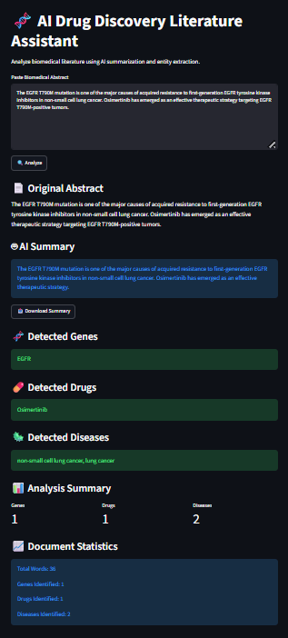

# 🧬 Biomedical Research Intelligence Platform

<div align="center">

### Transformer-Powered Biomedical Literature Analysis

Using abstractive summarization and biomedical named entity recognition (NER) to automatically extract insights from scientific literature.


</div>

---

## 📸 Application Preview



---

## 🚀 Overview

Biomedical research papers contain vast amounts of valuable information that can be difficult and time-consuming to analyze manually.

The Biomedical Research Intelligence Platform leverages modern Transformer-based Natural Language Processing (NLP) models to automatically:

- Summarize biomedical literature
- Extract key biomedical entities
- Generate research insights
- Analyze scientific abstracts
- Visualize extracted knowledge

This platform serves as a lightweight research assistant for biomedical scientists, students, and researchers.

---

## 🧠 AI Models Used

### 📄 Literature Summarization

Model:

```text
facebook/bart-large-cnn
```

Purpose:

- Abstractive summarization
- Scientific text compression
- Literature understanding

### 🧬 Biomedical Named Entity Recognition

Model:

```text
d4data/biomedical-ner-all
```

Purpose:

- Biomedical entity extraction
- Knowledge mining
- Scientific information retrieval

---

## ✨ Features

### 🤖 Transformer-Based Summarization

Generate concise summaries of biomedical abstracts using BART.

### 🧬 Biomedical NER

Automatically identify:

- Biomedical Markers
- Therapeutic Agents
- Clinical Features
- Clinical Parameters
- Research Entities

### 💡 Research Insight Engine

Generate high-level insights from detected biomedical entities.

### 📊 Literature Analytics

Interactive visualizations including:

- Entity distribution
- Confidence scoring
- Document statistics

### 📥 Downloadable Reports

Export generated summaries for further research use.

---

## 📈 Example Workflow

```text
Biomedical Abstract
          │
          ▼
BART Summarization
          │
          ▼
Biomedical NER
          │
          ▼
Research Insights
          │
          ▼
Analytics Dashboard
```

---

## 🛠️ Technology Stack

| Component | Technology |
|------------|------------|
| Language | Python |
| Frontend | Streamlit |
| NLP | Hugging Face Transformers |
| Summarization | BART |
| NER | Biomedical NER |
| Analytics | Plotly |
| Data Handling | Pandas |

---

## 📂 Project Structure

```text
Biomedical_Research_Intelligence_Platform/
│
├── app.py
├── README.md
├── requirements.txt
│
└── outputs/
    ├── demo_result.png
    └── final_demo.png
```

---

## 🎯 Applications

- Biomedical Literature Mining
- Scientific Knowledge Extraction
- Research Assistance
- Academic Literature Review
- Drug Discovery Research Support

---

## 👨‍💻 Author

**Nirupam Joarder**

B.Tech Biotechnology  
National Institute of Technology Rourkela

---

## ⭐ Future Improvements

- PubMed API Integration
- Research Paper Search Engine
- PDF Upload Support
- Knowledge Graph Generation
- Biomedical Question Answering
- Drug-Target Relationship Extraction

---

### Built using Transformer NLP and Biomedical AI