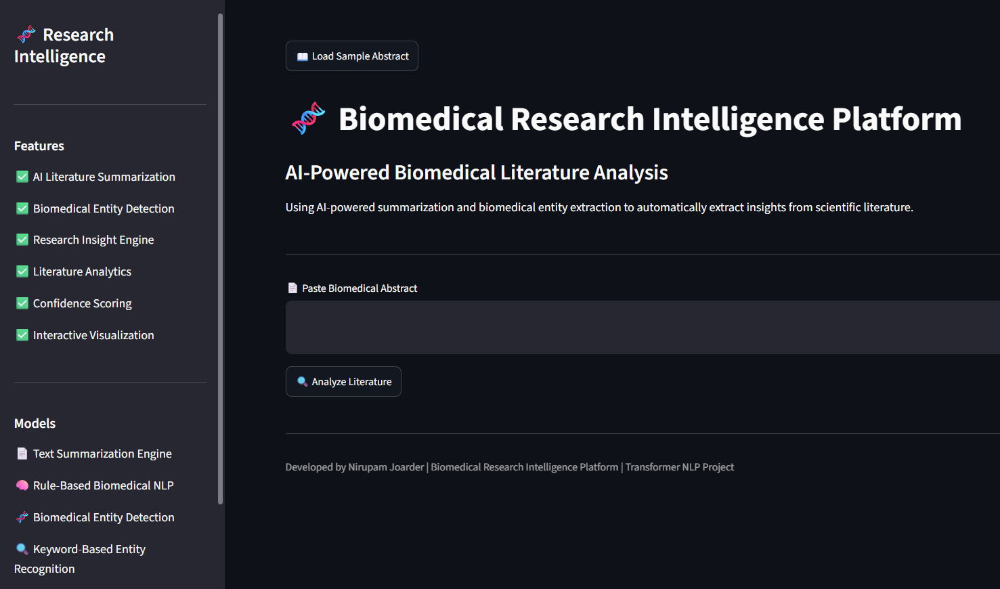
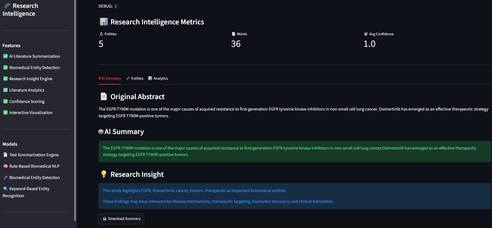
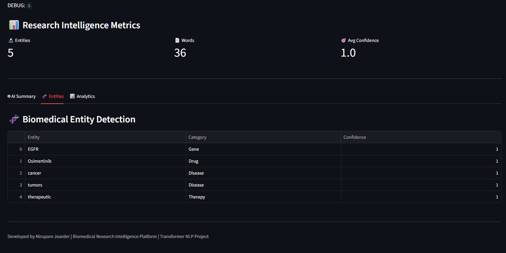
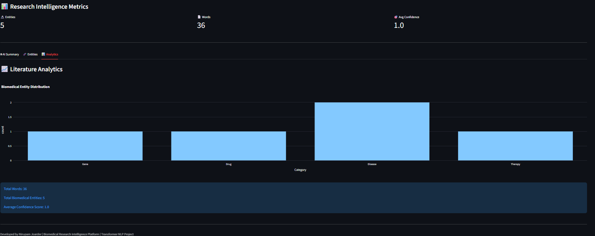

# 🧬 Biomedical Research Intelligence Platform

<div align="center">

### Transformer-Powered Biomedical Literature Analysis

Using abstractive summarization and biomedical named entity recognition (NER) to automatically extract insights from scientific literature.


</div>

---

## 🚀 Live Demo

🔗 https://biomedicalresearchintelligenceplatform.streamlit.app/

---

## 📌 Project Overview

Biomedical researchers often analyze large volumes of scientific literature to identify important genes, diseases, drugs, therapies, and biomarkers.

The Biomedical Research Intelligence Platform streamlines this process by automatically:

* Summarizing biomedical abstracts
* Detecting important biomedical entities
* Categorizing biomedical concepts
* Generating research insights
* Visualizing literature analytics
* Providing downloadable summaries

The platform offers a fast and user-friendly environment for biomedical literature exploration and preliminary research analysis.

---

## 🛠️ Technologies Used

| Technology     | Purpose                        |
| -------------- | ------------------------------ |
| Python         | Core Programming               |
| Streamlit      | Web Application Development    |
| Pandas         | Data Processing                |
| Plotly         | Interactive Visualizations     |
| Regex          | Biomedical Entity Extraction   |
| Rule-Based NLP | Literature Analysis & Insights |

---

## 🧬 Biomedical Entity Categories

The platform detects and classifies biomedical entities into the following categories:

| Category  | Examples                       |
| --------- | ------------------------------ |
| Gene      | EGFR, KRAS, TP53, BRCA1, BRCA2 |
| Drug      | Cetuximab, Osimertinib         |
| Disease   | Cancer, Tumor                  |
| Therapy   | Treatment, Therapeutic         |
| Biomarker | Biomarker, Biomarkers          |

---

## 📊 Example Workflow

1. Paste a biomedical abstract.
2. Click **Analyze Literature**.
3. Generate an automated summary.
4. Detect biomedical entities.
5. View categorized entities.
6. Generate research insights.
7. Explore literature analytics.
8. Download the generated summary.

---

## 📈 Dashboard Outputs

### Research Intelligence Metrics

* Total Biomedical Entities
* Word Count
* Confidence Score

### Biomedical Entity Detection

* Entity Name
* Category
* Confidence Score

### Literature Analytics

* Entity Distribution Visualization
* Summary Statistics

---

## 📷 Application Screenshots

### Home Page



### AI Summary & Research Insight



### Biomedical Entity Detection



### Literature Analytics Dashboard



---

## 🧪 Example Input

```text
The EGFR T790M mutation is one of the major causes of acquired resistance to first-generation EGFR tyrosine kinase inhibitors in non-small cell lung cancer. Osimertinib has emerged as an effective therapeutic strategy targeting EGFR T790M-positive tumors.
```

---

## ⚙️ Installation

Clone the repository:

```bash
git clone https://github.com/biotech-py/Biomedical_Research_Intelligence_Platform.git
cd Biomedical_Research_Intelligence_Platform
```

Install dependencies:

```bash
pip install -r requirements.txt
```

Run the application:

```bash
streamlit run app.py
```

---

## 📂 Project Structure

```text
Biomedical_Research_Intelligence_Platform/
│
├── app.py
├── README.md
├── requirements.txt
│
└── outputs/
    ├── homepage.png
    ├── summary.png
    ├── entities.png
    └── analytics.png
```

---

## 🎓 Skills Demonstrated

* Biomedical Natural Language Processing (NLP)
* Scientific Literature Analysis
* Biomedical Entity Extraction
* Information Retrieval
* Research Insight Generation
* Data Visualization
* Streamlit Application Development
* Research Data Analytics
* Python Programming

---

## 🔮 Future Improvements

* PubMed Integration
* PDF Research Paper Analysis
* Advanced Biomedical NER Models
* Multi-Document Analysis
* Knowledge Graph Generation
* Biomedical Question Answering System

---

## 👨‍💻 Author

**Nirupam Joarder**

Biomedical Engineering | Biomedical NLP | AI for Healthcare | Computer Vision

---

### Built using Transformer NLP and Biomedical AI
